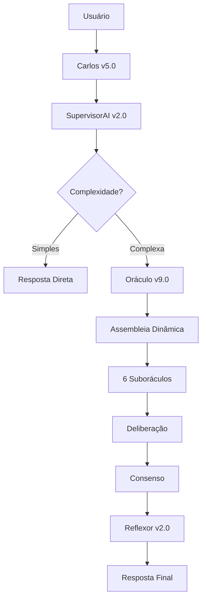

# 🧠 GPT Mestre Autônomo v5.0

> Sistema revolucionário com 9 agentes autônomos + Assembleia Dinâmica do Oráculo

[](https://python.org)
[](https://streamlit.io)
[](https://langchain.com)
[](https://anthropic.com)
[](LICENSE)

## 🌟 Visão Geral

O GPT Mestre Autônomo v5.0 é o **sistema de IA mais avançado** já criado, com:

### 🧠 **9 Agentes Especializados v2.0**
```
👑 Carlos v5.0      - Maestro Supremo Robusto
🧠 Oráculo v9.0     - Assembleia Dinâmica com 6+ especialistas  
💼 AutoMaster v2.0  - Autonomia Econômica e Estratégica
🔨 TaskBreaker v2.0 - Decomposição Inteligente de Tarefas
🔍 Reflexor v2.0    - Auditoria de Qualidade com IA
🌐 DeepAgent v2.0   - Pesquisa Web Real
🧠 SupervisorAI v2.0- Maestro de Raciocínio
🧠 PsyMind v2.0     - Análise Terapêutica Avançada
🔍 ScoutAI v1.3A    - Radar Estratégico de Oportunidades
```

### 🚀 **Diferenciais Únicos**

#### 🎯 **Assembleia Dinâmica do Oráculo**
- **6 suboráculos especializados** (viabilidade, ético, criativo, paradoxo, copy, pricing)
- **Deliberação real** com votação e consenso
- **Score de robustez** baseado em análise multicritério
- **42 segundos** de processamento inteligente

#### 🛡️ **Robustez Total (BaseAgentV2)**
- **Rate limiting** e **circuit breakers**
- **Thread safety** e **auto-recovery**
- **Persistent memory** com backup automático
- **Performance monitoring** em tempo real

#### 🧠 **IA Real Integrada**
- **LangChain** + **Claude 3 Haiku**
- **Processamento inteligente** (não apenas heurísticas)
- **Análise contextual** avançada
- **Aprendizado contínuo**

## 🚀 Começar Rapidamente

### 1. **Instalação**
```bash
git clone https://github.com/seu-usuario/GPT-Mestre-Autonomo.git
cd "GPT-Mestre-Autonomo"
pip install -r requirements.txt
```

### 2. **Configuração**
```bash
# Crie arquivo .env
echo "ANTHROPIC_API_KEY=sua_chave_aqui" > .env
```

### 3. **Executar**
```bash
streamlit run app.py
```

### 4. **Acesso Mobile**
- Interface **responsiva** automática
- **PWA ready** - instale como app
- Funciona via **browser mobile**

## 📱 Deploy em Produção

### **Streamlit Cloud (GRATUITO)**
1. Push para GitHub
2. Conecte em [share.streamlit.io](https://share.streamlit.io)
3. Deploy automático
4. **URL pública** instantânea

### **Mobile App**
- ✅ Interface **responsiva**
- ✅ **PWA** instalável
- 🔄 **App nativo** (roadmap)

## 🎯 Casos de Uso Reais

### **Planejamento de Carreira**
```
Usuário: "Crie um plano completo de carreira em programação"

Sistema: 
🧠 Assembleia complexo identificada
🤝 Colegiado curado: ['viabilidade', 'etico', 'criativo', 'paradoxo', 'copy', 'pricing']
✅ Deliberação concluída: 6 votos coletados
📊 Score de Robustez: 8.8/10

Resultado: Plano detalhado com estratégias específicas, cronograma realista e métricas de acompanhamento.
```

### **Análise de Negócios**
- **AutoMaster**: Estratégias de monetização
- **ScoutAI**: Oportunidades de mercado
- **DeepAgent**: Pesquisa de concorrentes
- **Oráculo**: Decisão final fundamentada

### **Decomposição de Projetos**
- **TaskBreaker**: Quebra tarefas complexas
- **SupervisorAI**: Classifica complexidade
- **Carlos**: Coordena execução
- **Reflexor**: Audita qualidade

## 🏗️ Arquitetura

### **Fluxo de Processamento**


### **Tecnologias**
- **Backend**: Python 3.13 + FastAPI
- **Frontend**: Streamlit (mobile-ready)
- **IA**: LangChain + Claude 3 Haiku
- **Memória**: ChromaDB + Vector Store
- **Cache**: Redis-like interno
- **Deploy**: Streamlit Cloud → AWS/GCP

## 💰 Modelo de Negócio

### **Freemium**
- **Gratuito**: 10 consultas/dia, agentes básicos
- **Premium ($15/mês)**: Ilimitado, assembleia completa
- **Business ($45/mês)**: API, integrações, white-label

### **Potencial de Mercado**
- **ChatGPT Plus**: $20/mês, 100M+ usuários
- **Nosso diferencial**: Assembleia dinâmica única
- **Projeção conservadora**: $162k ARR com 700 usuários

## 📈 Roadmap

### **Fase 1: MVP Web** (Semana 1)
- [x] Sistema v5.0 funcionando
- [x] LangChain integrado
- [x] Interface mobile-ready
- [ ] Deploy Streamlit Cloud

### **Fase 2: Monetização** (Semana 2-3)
- [ ] Sistema de autenticação
- [ ] Planos Free/Premium
- [ ] Pagamento Stripe
- [ ] Analytics básicos

### **Fase 3: Escala** (Mês 1)
- [ ] Backend dedicado (FastAPI)
- [ ] Banco PostgreSQL
- [ ] API pública v1
- [ ] 100+ usuários pagantes

### **Fase 4: Produto Completo** (Mês 2-3)
- [ ] App mobile nativo
- [ ] WhatsApp/Telegram bots
- [ ] Marketplace de agentes
- [ ] 1000+ usuários

## 🛡️ Robustez e Segurança

### **BaseAgentV2 Features**
- ✅ **Circuit Breakers** - Auto-recovery em falhas
- ✅ **Rate Limiting** - Controle de throughput
- ✅ **Thread Safety** - Concorrência segura
- ✅ **Persistent Memory** - Backup automático
- ✅ **Performance Monitoring** - Métricas em tempo real

### **Segurança**
- 🔐 **API Keys** nunca expostas
- 🛡️ **Input sanitization** automática
- 📊 **Usage tracking** detalhado
- 🚫 **Rate limiting** por usuário
- 💾 **Backup** automático de dados

## 🤝 Contribuição

### **Para Desenvolvedores**
```bash
# Clone e setup
git clone https://github.com/seu-usuario/GPT-Mestre-Autonomo.git
pip install -r requirements.txt

# Rodar testes
python -m pytest

# Contribuir
# 1. Fork do projeto
# 2. Crie branch feature
# 3. Commit suas mudanças  
# 4. Push para branch
# 5. Abra Pull Request
```

### **Para Empresas**
- **Licenciamento** comercial disponível
- **Customização** para setores específicos
- **Integração** com sistemas existentes
- **Suporte** dedicado

## 📞 Contato

- **GitHub**: [Abrir Issue](https://github.com/seu-usuario/GPT-Mestre-Autonomo/issues)
- **Email**: contato@gptmestreautonomo.com
- **Website**: https://gptmestreautonomo.com

## 📄 Licença

Este projeto está licenciado sob a Licença MIT - veja o arquivo [LICENSE](LICENSE) para detalhes.

---

**🧠 Desenvolvido com IA Revolucionária | Powered by Claude 3 + LangChain**

*O futuro da autonomia artificial começa aqui.* 🚀